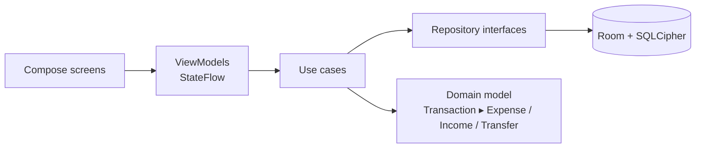

# Denarii Dolor

[](https://github.com/jabbott-iii/DenariiDolor/actions/workflows/ci.yml)
[](https://github.com/jabbott-iii/DenariiDolor/actions/workflows/security.yml)
[](LICENSE)

**A private, offline budget and expense tracker for Android.** Log income, expenses and transfers across your accounts, set monthly budgets per category, search your history, and export monthly reports as CSV or PDF. Everything stays on your phone, in an encrypted database, behind a PIN or biometric sign-in.

*Denarii dolor* is Latin for "the pain of money".

---

## Contents

- [Features](#features)
- [Use cases](#use-cases)
- [Getting started](#getting-started)
- [User guide](#user-guide)
- [Examples](#examples)
- [For developers](#for-developers)
- [Security](#security)
- [License](#license)

## Features

| Area | What you get |
|---|---|
| **Transactions** | Add, edit and delete **expenses**, **income** and **transfers**. Account balances update automatically and atomically. |
| **Accounts** | Starts with Cash and Savings. Add your own accounts with an opening balance, and rename or delete them. |
| **Categories** | 24 built-in icons (Groceries, Dining, Fuel, Housing, Utilities, Travel, …). Names must be unique. |
| **Budgets** | A monthly limit per category with a warning threshold. The Dashboard meters show *On track*, *Near limit* or *Over budget*, and an expense that would exceed a limit is blocked. |
| **Dashboard** | Monthly net, income and expense totals; a spending-by-category chart; budget meters and alerts; account balances; recent transactions. |
| **Search** | Filter by description text, category, amount range and date range. The results show as a multi-row list, and you tap a row to edit it. |
| **Reports** | A monthly spending report with a title, a generated timestamp, totals, and a 6-column table (Date, Type, Category, Description, Amount, Payment Method). **Save** or **Share** it as **CSV** or **PDF**. |
| **Validation** | Rejects zero or negative amounts, amounts with more than 2 decimals, blank descriptions, invalid dates, transfers to the same account, duplicate names, and inverted search ranges. |
| **Security** | PIN (6–12 digits) with escalating lockout; strong biometrics; SQLCipher-encrypted database; encrypted preferences; 5-minute session timeout; no cloud backup. |
| **Look & feel** | Material 3, a dark mode switch, bottom navigation, and a floating **+** button for quick entry. |

## Use cases

- **Everyday spending log:** record the coffee, the groceries and the fuel as they happen, then see at a glance where the month's money went.
- **Staying under budget:** give Dining a $200 monthly limit with an 80% warning. The Dashboard flags it as *Near limit* at $160, and the app refuses an expense that would push it past $200.
- **Moving money between accounts:** a transfer from Cash to Savings moves the balance without counting as income or spending.
- **Finding a past purchase:** search "pharmacy" between two dates to find what you paid and when.
- **Month-end review or taxes:** export the month's report to CSV for a spreadsheet, or to PDF to print or share with a partner or accountant.
- **Privacy-conscious budgeting:** no account, no sign-up, no network, and no ads; your financial data never leaves the device.

## Getting started

**Requirements:** Android 8.0 (API 26) or newer.

1. Download the latest `.apk` from [**Releases**](https://github.com/jabbott-iii/DenariiDolor/releases).
2. *(Optional)* Verify it: `sha256sum app-release.apk` should match the entry in `SHA256SUMS.txt`.
3. Open the file on your phone. If Android asks, allow the browser or file manager to install unknown apps. Then tap **Install**.

## User guide

### 1. First launch

1. Choose a **PIN** (6–12 digits) and confirm it.
2. Write a **security question** only you can answer, and give its **answer**. You'll need the answer if you forget your PIN.
3. Tap **Create Security Profile**, then sign in.

### 2. Signing in

- Enter your PIN and tap **Sign In**, or tap **Sign In with Biometrics**. The biometrics button appears only when a strong fingerprint or face is enrolled on the phone.
- After **5 wrong attempts**, sign-in locks for 30 seconds, and each further lockout doubles the wait (up to 15 minutes).
- After **5 minutes** without using the app, you're returned to the sign-in screen.
- **Forgot PIN?** Answer your security question and choose a new PIN. Tap **Back to Sign In** (or use the back gesture) to cancel.
- **Wipe All App Data** permanently erases everything and starts fresh. Use it only if you can't recover your PIN.

### 3. Getting around

| Tab | Purpose |
|---|---|
| **Dashboard** | This month's totals, chart, budgets, balances and recent transactions |
| **Search** | Find transactions by text, category, amount or date |
| **Reports** | Monthly report; save or share it as CSV or PDF |
| **Settings** | Dark mode; manage categories, accounts and budgets; sign out |

Tap the round **+** button to add a transaction. The **Back** button on that form returns you to the screen you came from.

### 4. Adding a transaction

1. Tap **+** and choose **EXPENSE**, **INCOME** or **TRANSFER**.
2. Fill in:
   - **Description**
   - **Amount** (e.g. `12.50`)
   - **Date** (from the calendar)
   - **Account** and **Category**
   - For a transfer, a different **Transfer to account**
3. Tap **Save Transaction**.

To edit a transaction, tap it on the Dashboard or in the Search results. To delete one, tap **Delete** on a Dashboard row and confirm; balances are corrected automatically.

### 5. Budgets, categories and accounts

Open **Settings**, then:

- **Manage Budgets:** pick a category and set a monthly limit and a warning percentage (1–100).
- **Manage Categories:** add a category with an icon, or edit or delete one. The defaults can't be deleted, and neither can categories that are in use.
- **Manage Accounts:** add an account with an opening balance, or rename or delete one. Cash and Savings can't be deleted, and neither can accounts that are in use.

### 6. Reports

Open **Reports** and use **‹ Prev** / **Next ›** to pick the month. **Save CSV** / **Save PDF** saves the file to a location you choose; **Share CSV** / **Share PDF** sends it to another app.

> Exported files are not encrypted. Store them somewhere safe.

## Examples

**A month in the app**

| Date | Type | Category | Description | Amount | Account |
|---|---|---|---|---|---|
| Sep 1 | INCOME | General Income | Paycheck | 2,400.00 | Cash |
| Sep 2 | TRANSFER | Transfer | Emergency fund | 300.00 | Cash → Savings |
| Sep 3 | EXPENSE | Groceries | Weekly shop | 86.40 | Cash |
| Sep 5 | EXPENSE | Dining | Pizza night | 32.15 | Cash |

The Dashboard shows **Income $2,400.00 · Expenses $118.55 · Net $2,281.45**. The transfer changes the balances (Cash −300, Savings +300) but not the net. With a Dining budget of $50 and an 80% warning, the Dining meter reads *Near limit · 64% used*… no, *On track*, until spending reaches $40.

**Search**

Description `shop`, category *Groceries*, amounts `50`–`100`, dates Sep 1 – Sep 30 → **1 result(s)**: *Weekly shop, 86.40*.

**CSV export** (`spending-report-2026-09.csv`)

```csv
title,Monthly Spending Report
period,September 2026
generated_at,2026-09-30 18:05 MST
total_income,2400.00
total_expense,118.55
net,2281.45

date,type,category,description,amount,payment_method
2026-09-01,INCOME,General Income,Paycheck,2400.00,Cash
2026-09-02,TRANSFER,Transfer,Emergency fund,300.00,Cash → Savings
2026-09-03,EXPENSE,Groceries,Weekly shop,86.40,Cash
2026-09-05,EXPENSE,Dining,Pizza night,32.15,Cash
```

The same report exported as **PDF** has the title, period, timestamp, totals and a paginated 6-column table.

## For developers

**Stack:** Kotlin 2.0 · Jetpack Compose (Material 3) · MVVM + use cases + repositories · Hilt · Room + SQLCipher · Coroutines/Flow · Vico charts · minSdk 26 / targetSdk 35 · AGP 8.7 · JDK 17.



`Transaction` is an abstract base class. `Expense`, `Income` and `Transfer` each override `balanceImpact()` and `accountImpacts()`, so balances and reports never branch on the transaction type.

```bash
git clone https://github.com/jabbott-iii/DenariiDolor.git && cd DenariiDolor
./gradlew installDebug                 # build and install on a device/emulator
./gradlew testDebugUnitTest            # unit tests
./gradlew connectedDebugAndroidTest    # instrumented tests (device required)
./gradlew ktlintFormat detekt lintDebug  # format and static analysis
make release VERSION=v1.2.3            # tag and push → CD builds a signed GitHub Release
```

| Path | Contents |
|---|---|
| `app/src/main/java/com/denariidolor/domain` | Models, use cases, report formatting |
| `…/data` | Room entities/DAOs/migrations, repositories, encrypted preferences, export |
| `…/presentation/ui` | Compose screens and ViewModels, one package per feature |
| `…/di` | Hilt modules |
| `app/schemas` | Exported Room schemas (commit a new one with every schema change) |
| `.github/workflows` | `ci.yml` (lint, tests, build, emulator tests on API 26 and 35), `security.yml` (CodeQL, dependency review, gitleaks), `cd.yml` (signed release on `v*` tags) |

Release signing needs four repository secrets: `ANDROID_SIGNING_KEY` (the base64-encoded keystore), `ANDROID_SIGNING_KEYSTORE_PASSWORD`, `ANDROID_SIGNING_KEY_ALIAS` and `ANDROID_SIGNING_KEY_PASSWORD`. For contribution rules, see [CONTRIBUTING.md](CONTRIBUTING.md) and the [Code of Conduct](CODE_OF_CONDUCT.md).

## Security

- **Encryption at rest:** SQLCipher database with a random 256-bit key, which is held in EncryptedSharedPreferences under an Android Keystore AES-256-GCM master key.
- **Credentials:** the PIN and security answer are stored only as PBKDF2-HMAC-SHA256 hashes and compared in constant time. Failed PIN and recovery attempts share the escalating lockout.
- **Biometrics:** `BIOMETRIC_STRONG` only, with the PIN as the fallback.
- **Other controls:**
  - 5-minute session timeout.
  - `allowBackup=false`, with data-extraction rules.
  - Parameterized Room queries only.
  - A CSV formula-injection guard.
  - Exports shared through FileProvider grants.
  - R8 obfuscation for release builds.

To report a vulnerability, open a private security advisory on this repository rather than a public issue.

## License

[Apache License 2.0](LICENSE). See [NOTICE](NOTICE).
