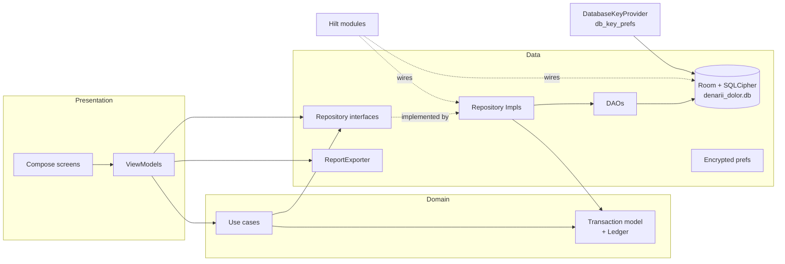
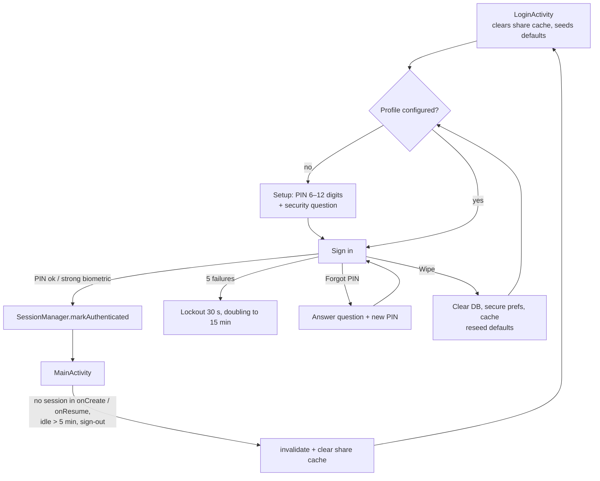
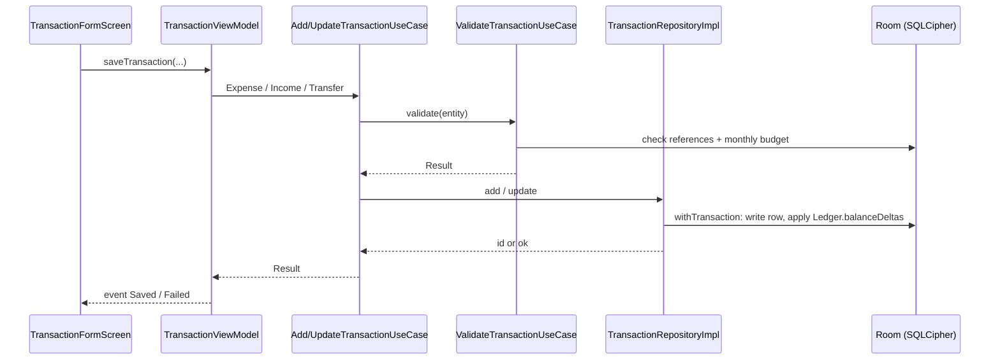
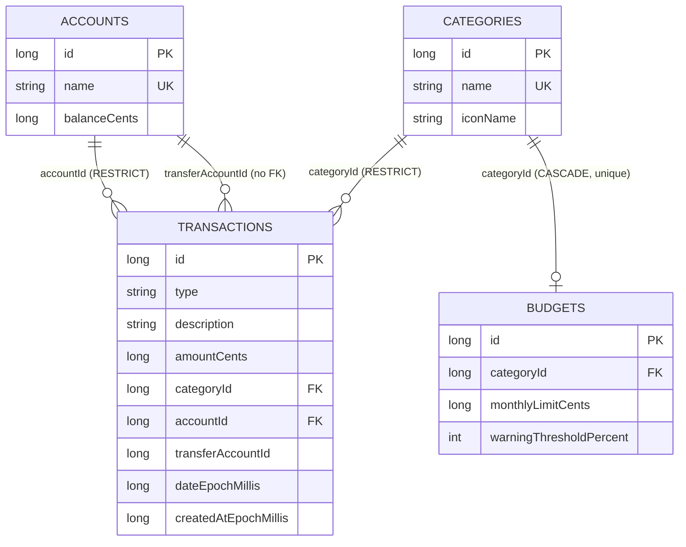

# Denarii Dolor — Repository Map (`map.md`)

A concise map of the repository and its main flows. The architecture rules are in [`maint.md`](maint.md).

## Repository layout

| Path | Contents |
|---|---|
| `app/build.gradle.kts` | Android config (min 26 / target 35), R8, env-based release signing, ktlint and detekt setup |
| `app/proguard-rules.pro` | R8 keep rules (the only keep file AGP reads) |
| `app/schemas/` | Exported Room schemas `1.json` and `2.json`; also an `androidTest` asset for `MigrationTest` |
| `app/src/main/AndroidManifest.xml` | `LoginActivity` (launcher), `MainActivity`, FileProvider; `allowBackup=false` |
| `app/src/main/res/xml/` | Backup and data-extraction exclusions; FileProvider path `cache/reports/` |
| `app/src/main/java/com/denariidolor/` | App source (below) |
| `app/src/test/` | JVM unit tests; fakes in `testutil/` |
| `app/src/androidTest/` | Room/SQLCipher, migration, repository, PDF and Compose UI tests |
| `gradle/libs.versions.toml` | Version catalog (the only place versions are set) |
| `config/detekt/detekt.yml` | detekt overrides on top of the default rules |
| `.github/workflows/` | `ci.yml`, `security.yml`, `cd.yml` |
| `.github/dependabot.yml` | Weekly Gradle and Actions updates |
| `Makefile` | `make release VERSION=vX.Y.Z` → tag → CD |
| `intel/` | `maint.md`, `map.md`, `cybersec.md`, `notes.md`, `plan.md`, `history.md` |
| `AGENTS.md`, `CONTRIBUTING.md`, `README.md` | Agent rules, contribution rules, user and developer overview |

## Source packages (`com.denariidolor`)

| Package | Key components |
|---|---|
| (root) | `App` (`@HiltAndroidApp`), `MainActivity` (session gate + Compose host) |
| `domain/model` | `Transaction` → `Expense` / `Income` / `Transfer`; `TransactionType`; `Account`, `Category`, `Budget`; `Ledger`; `SearchFilters`; `MonthlyReport`; entity ↔ domain mappings |
| `domain/usecase` | `Add`/`Update`/`Delete`/`Validate`/`SearchTransactionUseCase`, `GenerateReportUseCase`, `Category`/`Account`/`BudgetUseCases` |
| `domain/report` | `ReportCsvFormatter` (formula-injection guard), `ReportText` |
| `data/local/db` | `AppDatabase` (v2), `entity/`, `dao/`, `Migrations.kt` (`MIGRATION_1_2`), `DefaultDataInitializer`, `security/` (`DatabaseKeyProvider`, `DatabaseKeys`) |
| `data/local/preferences` | `SecurityProfileService` (PIN/answer hashing, lockout; pure Kotlin), `EncryptedPreferencesManager` (`secure_prefs`), `ThemePreferences` (`ui_prefs`) |
| `data/repository` | `Transaction`/`Category`/`Budget`/`AccountRepository` + `Impl` |
| `data/export` | `ReportExporter` (SAF save, FileProvider share, share-cache cleanup), `ReportPdfRenderer` |
| `di` | `AppModule`, `DatabaseModule`, `RepositoryModule` |
| `presentation/ui` | `AppScreens.kt` (NavHost), `LoginScreen.kt`, `TransactionFormScreen.kt`, `SettingsScreen.kt`; feature packages `auth`, `dashboard`, `search`, `report`, `transaction`, `category`, `account`, `budget`, `settings`, `common` |
| `util` | `Money`, `Validators`, `DateUtils`, `SessionManager`, `Constants`, `ResultExt` |

## Layer dependencies

## Sign-in and session

## Saving a transaction

## Data model (schema v2)

## CI/CD

| Workflow | Trigger | Jobs |
|---|---|---|
| `ci.yml` | push/PR to `main`, manual | ktlint → detekt → lint → unit tests → JaCoCo → `assembleRelease`; then emulator tests on API 26 and 35 |
| `security.yml` | push/PR to `main`, Mondays 02:00 UTC, manual | CodeQL (`security-extended`), dependency graph (push/schedule), dependency review (PR, fails on high), gitleaks |
| `cd.yml` | `v*` tag | unit tests → signed AAB/APK → signature check → GitHub Release with `SHA256SUMS.txt`; private R8 mapping artifact |
